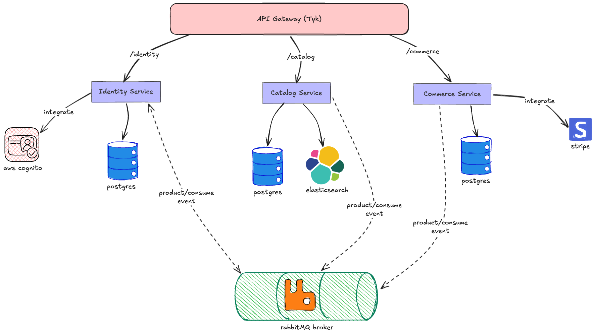

# 2Hand Shop — Second-Hand Marketplace

A microservice-based second-hand marketplace built with **Go (Golang)** and **React 19**. Three services follow Domain-Driven Design (DDD) and CQRS with event-driven communication via RabbitMQ.

---

## Architecture Overview



## Bounded Contexts

| Context | Responsibility |
|---|---|
| **Identity** | User management, Auth/AuthZ via AWS Cognito, Profiles |
| **Catalog** | Products, Categories, Item conditions (PostgreSQL + Elasticsearch) |
| **Commerce** | Orders, Cart, Payments via Stripe |
<!-- | **Notification** | Email, Push, In-app real-time (purely reactive) | -->

---

## Tech Stack

### Backend
- **Language:** Go
- **Architecture:** Microservices · DDD · CQRS
- **API Gateway:** Tyk
- **Message Broker:** RabbitMQ (Amazon MQ on AWS)
- **Database:** PostgreSQL (write) · Elasticsearch (read) · Redis (cache/sessions)
- **Cloud:** AWS

### Frontend
- **Framework:** React 19
- **Routing:** React Router v7 (file-based routes)
- **Styling:** Tailwind CSS + shadcn/ui

---

## CQRS Pattern

Commands (writes) and queries (reads) are fully separated:

```
Command Side                        Query Side
────────────                        ──────────
POST /products                      GET /products?q=...
      │                                    │
┌─────▼──────┐                    ┌────────▼──────┐
│  Command   │                    │ Query Handler │
│  Handler   │                    │               │
└─────┬──────┘                    └────────┬──────┘
      │                                    │
┌─────▼──────┐  Domain Event     ┌─────────▼──────┐
│  Postgres  │──product.created─►│ Elasticsearch  │
│  (Write)   │                   │    (Read)      │
└────────────┘                   └────────────────┘
```

---

## Project Structure

```
2hand-shop/
├── CLAUDE.md                  # Detailed codebase guidance
├── Taskfile.yml               # Task automation
│
├── deployments/local/         # Docker Compose for local dev
│
├── gateway/                   # Tyk API Gateway config
│
├── internal/
│   ├── pkg/                   # Shared libraries (CQRS, errors, HTTP, RabbitMQ, etc.)
│   └── services/
│       ├── identity/           # Identity microservice
│       ├── catalog/            # Catalog microservice
│       ├── commerce/           # Commerce microservice
│       └── notification/       # Notification microservice
│
├── migrations/                 # SQL migrations per bounded context
│
├── scripts/                    # Dev helper scripts
│
└── web/                       # React 19 frontend (in progress)
```

Each microservice follows the same internal layout:

```
cmd/           — Entry points
config/        — Configuration
internal/
  domain/      — DDD core (zero external deps)
  application/ — Use cases (CQRS commands/queries)
  infrastructure/ — Adapters (DB, messaging)
  transports/  — HTTP / gRPC delivery
  bootstrap/   — DI wiring
test/          — BDD tests
```